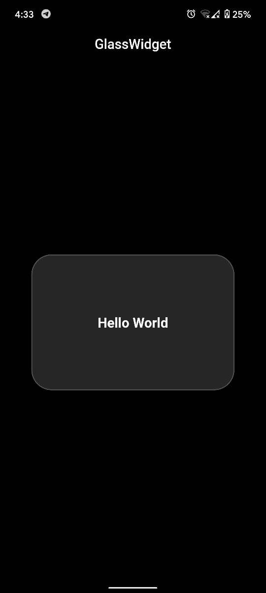

#  [Glasswidgets](https://pub.dev/packages/glasswidgets)

* A new Flutter package for easy implementation of glassmorphism in flutter apps.

## Getting Started

Currently This package only contains Glasscontainer 

### soon going to add more widgets in this package 
1. glassbutton
2. glassalert
3. glasssnackbar
4. glasscard
etc. 

# screenshots


## Usage

[Example](https://github.com/yashraut362/Glasswidgets/blob/main/example/lib/main.dart)

To use this package :

* add the dependency to your [pubspec.yaml](https://github.com/KarimMohamed2005/SplashScreenFlutterPackage/blob/master/pubspec.yaml) file.

```yaml
  dependencies:
    flutter:
      sdk: flutter
    glasswidgets:
```

### How to use


``` dart
new GlassContainer(
            glasscurve: 30, //giving curve to glassmorphic container
            glassheight: 200, //giving height to glassmorphic container
            glasswidth: 300, //giving width to glassmorphic container
            glasswidget: //Child widget u can use any flutter widget over here.
                Center(
              child: Text(
                'Hello World',
                textAlign: TextAlign.center,
                style: TextStyle(
                    color: Colors.white,
                    fontSize: 20,
                    fontWeight: FontWeight.bold),
              ),
            ),
          ),
```
